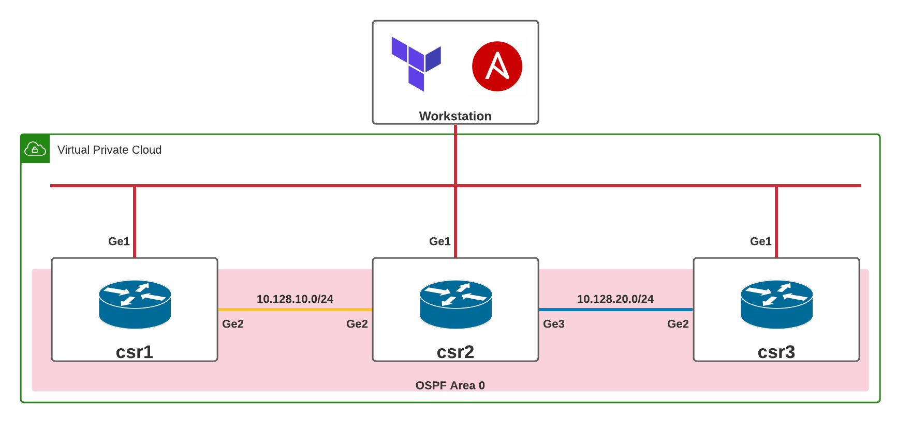

# Cisco CSR Terraform template
A simple Terraform template that sets up a set of inteconnected Cisco CSRs to quick demonstrate different network automation concepts.

## Architecture Diagram

<!-- BEGINNING OF PRE-COMMIT-TERRAFORM DOCS HOOK -->
## Requirements

No requirements.

## Providers

| Name | Version |
|------|---------|
| random | n/a |
| local | n/a |
| template | n/a |
| aws | n/a |

## Inputs

| Name | Description | Type | Default |
|------|-------------|------|---------|
| csr\_ami\_id | n/a | `string` | `""` |
| csr\_instance\_size | n/a | `string` | `"t2.medium"` |
| default\_tags | n/a | `map(any)` | `{}` |
| name\_prefix | n/a | `string` | `""` |
| key\_pair | n/a | `string` | `""` |

## Outputs

| Name | Description |
|------|-------------|
| csr\_1\_mgmt | n/a |
| csr\_2\_mgmt | n/a |
| csr\_3\_mgmt | n/a |
| admin\_password | n/a |

<!-- END OF PRE-COMMIT-TERRAFORM DOCS HOOK -->